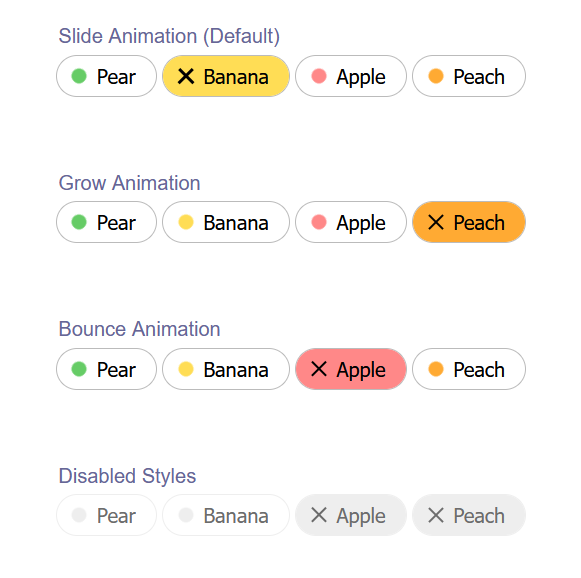

# Animated Toggle Pill

An elegant and interactive animated toggle pill built using HTML and CSS.

## Table of Contents

- [Introduction](#introduction)
- [Features](#features)
- [Screenshots](#screenshots)
- [Contributing](#contributing)
- [License](#license)

## Introduction

This project demonstrates how to create an animated toggle pill using only HTML and CSS. The toggle pill can be used as a stylish and responsive switch component in web applications.

## Features

- Smooth animations
- Pure HTML and CSS
- Easy to integrate
- Responsive design

## Screenshots

Here are some screenshots of the animated toggle pill in action:

## Contributing

Contributions are welcome! If you have any ideas, suggestions, or bug fixes, feel free to open an issue or create a pull request. Fork the repository, create a new branch, make your changes, and submit a pull request.

## License

This project is licensed under the MIT License. See the LICENSE file for details.
